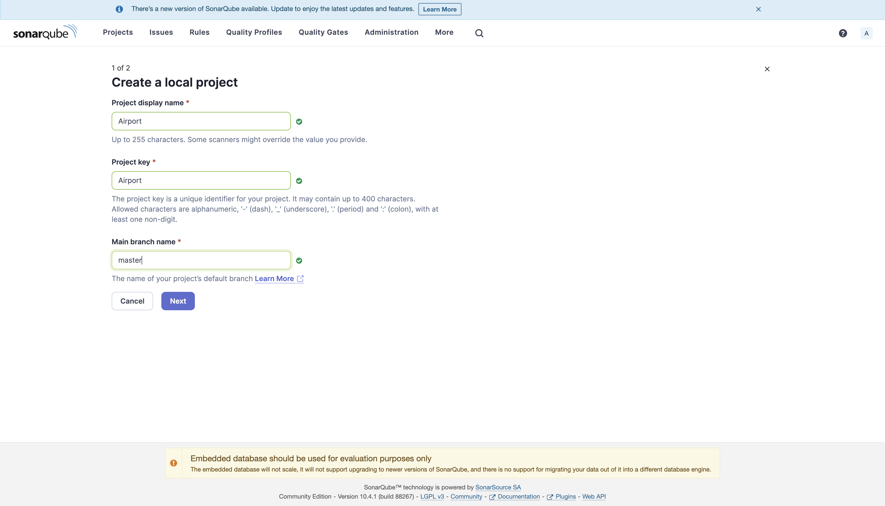
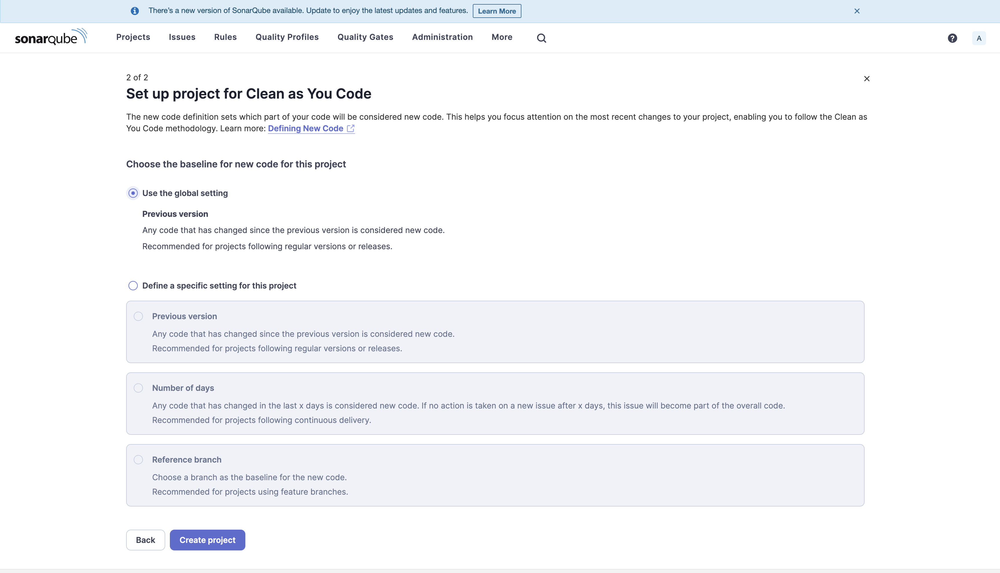
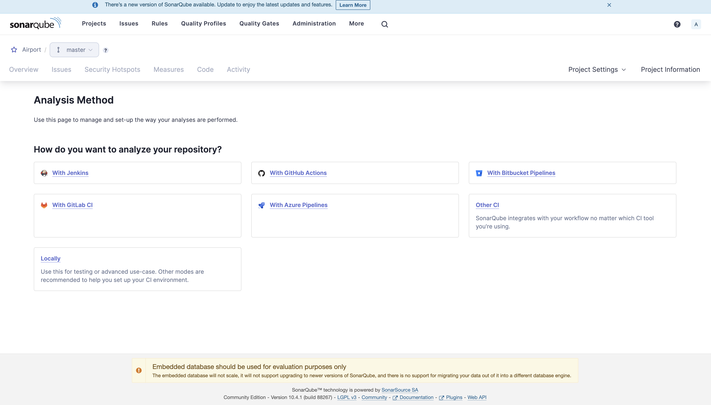
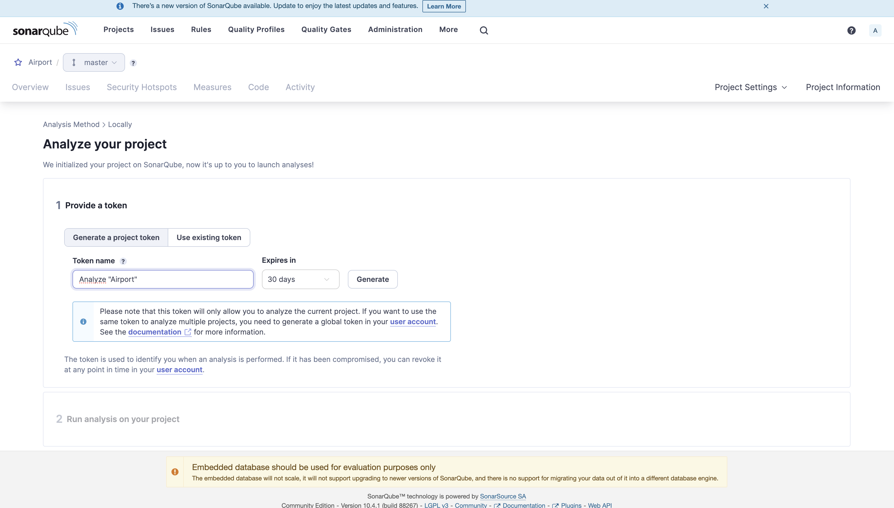
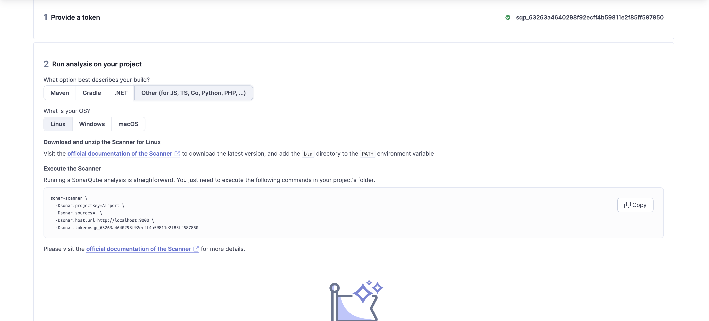

# System Pre-requisites

- node: 22.1.0

## Steps to setup SonarQube locally

- Ensure that the `sonarqube` and `sonarqube-database` containers are up.
- Hit [this link](http://localhost:9000/)
- Create a new local project named `Airport_frontend` with project key as `Airport_frontend`
- Change `main` to `master` 
- Select an option of your choice for the second step 
- Click `Create project`
- Select `locally` 
- Give a token name of your choice and click `generate` (COPY THE TOKEN) 
- Select `other` for `Run analysis on your project` 
- Install `sonar-scanner` using [homebrew](https://brew.sh/) (Skip if already installed)
- Create a file named `sonar-project.properties` in the project root and paste the following lines (modify to your settings as appropriate)

``` java
  sonar.projectKey=Airport_frontend
  sonar.projectName=Airport_frontend
  sonar.sources=.
  sonar.sourceEncoding=UTF-8
  sonar.test.inclusions=**/*.spec.js,**/*.test.js
  sonar.javascript.lcov.reportPaths=coverage/lcov.info
  sonar.javascript.file.suffixes=.js,.jsx
  sonar.login=admin
  sonar.password=<YOUR_PASSWORD>
  sonar.token=<YOUR_TOKEN>
```

- Run `sonar-scanner` to do analysis.
